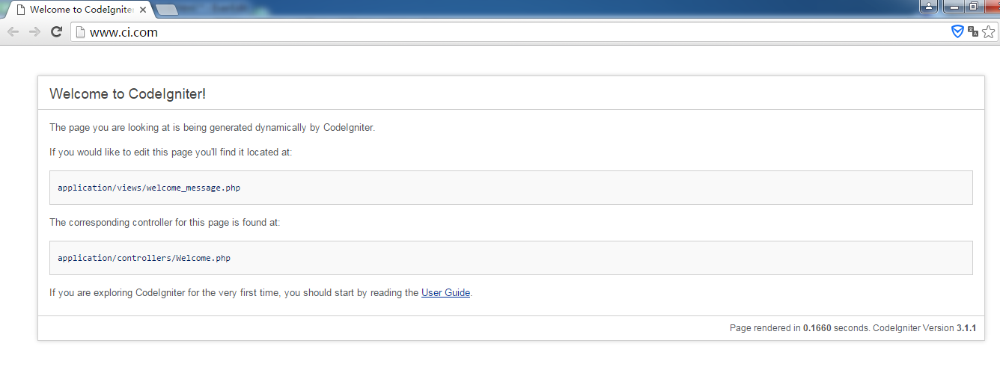

#第一章 下载安装#

前往官网，下载最新的CodeIgniter到本地。我是去CodeIgniter中国下载的3.1.1稳定版。

然后解压，放到你的目录，配置好，打开浏览器，输入http://www.ci.com/。 你会看到：Welcome to CodeIgniter! 这就表示第一步完成了。

接下来是配置数据库。

打开application\config目录下的database。移动到底部，修改数据库配置。
	$db['default'] = array(
		'dsn'	=> '',
		'hostname' => 'localhost',
		'username' => 'root',
		'password' => '',
		'database' => 'ci',
		'dbdriver' => 'mysqli',
		'dbprefix' => '',
		'pconnect' => FALSE,
		'db_debug' => (ENVIRONMENT !== 'production'),
		'cache_on' => FALSE,
		'cachedir' => '',
		'char_set' => 'utf8',
		'dbcollat' => 'utf8_general_ci',
		'swap_pre' => '',
		'encrypt' => FALSE,
		'compress' => FALSE,
		'stricton' => FALSE,
		'failover' => array(),
		'save_queries' => TRUE
	);
名称也比较易懂，就不赘述了。
此外，打开application\config目录下的autoload，
加入
	$autoload['libraries'] = array('database');
这样数据库就配置ok了。