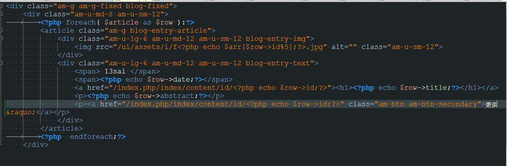
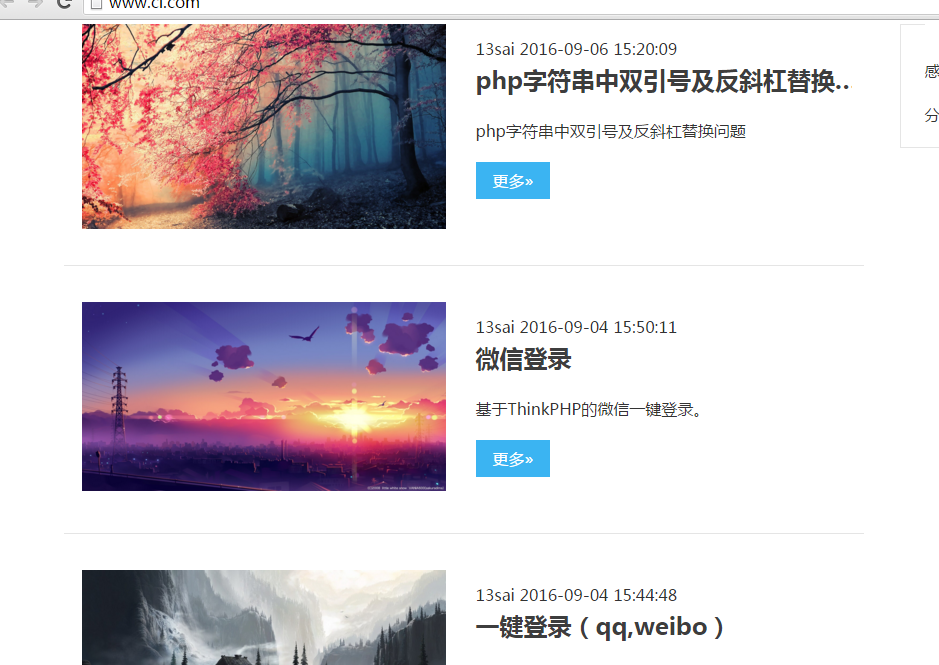

#第二章 制作文章列表#

我们直接来做一个文章列表。

大家都知道，ci的结构是MVC，所以我们就要建模型，增加控制器，新增视图模板。 （如果你问我MVC是什么？自己寻找答案吧！）
模型：

打开application\models目录，新建articleModel，输入php标签，加入：
```php
class articleModel extends CI_Model {
	public function __construct()
	{
		parent::__construct(); 
	}

	public function getArticles($table)
	{
		$data = $this->db->order_by('id','desc')->get($table);
		return $data->result();
	}
}
```
表结构如下：

控制器：

打开application\models目录，复制Welcome重命名为articleController。
```php
	class articleController extends CI_Controller {

		public function __construct(){
	        parent::__construct();
	        $this->load->model('articleModel');
	    }

	    public function index(){

	        $data['article'] = $this->articleModel->getArticles('article');
	        
	        $data['title'] = array('id'=>2);
	        $data['arr'] = array('12','10','19','22','20');
	        
	        $this->load->view('header');
	        $this->load->view('index', $data);
	        $this->load->view('footer');
	    }
	}
```
视图：
视图模板我用的是amazeUI的一个模板，就不用写那么多样式了。
下面是index.php主要代码。(代码最后我会打包放在教程里。)
```html
<div class="am-g am-g-fixed blog-fixed">
    <div class="am-u-md-8 am-u-sm-12">
		<?php foreach( $article as $row ):?>
        <article class="am-g blog-entry-article">
            <div class="am-u-lg-6 am-u-md-12 am-u-sm-12 blog-entry-img">
                id%5];?>.jpg" alt="" class="am-u-sm-12">
            </div>
            <div class="am-u-lg-6 am-u-md-12 am-u-sm-12 blog-entry-text">
                <span> 13sai </span>
                <span><?php echo $row->date;?></span>
                <a href=""><h1><?php echo $row->title;?></h1></a>
                <p><?php echo $row->abstract;?></p>
                <p><?php echo anchor('article/artShow/'.$row->id,'鏇村&raquo;','class="am-btn am-btn-secondary"')?></p>
            </div>
        </article>
		<?php  endforeach;?>
    </div>
```


看效果之前，需修改路由配置。
打开application\config目录下*routes*，修改默认控制器，
```php
$route['default_controller'] = 'articleController';
```
打开浏览器，你可以看到列表：




好了，这样我们第一个文章列表就完成了。
下一节我们来为列表添加分页。

