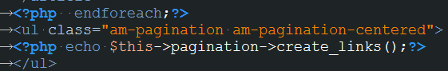

#第三节 分页#


我们来给前面的文章列表加上。

ci已经为分页写好了类，我们可以直接调用。来看代码：
```php
	class articleController extends CI_Controller {

		public function __construct(){
	        parent::__construct();
	        $this->load->model('articleModel');
	        $this->load->helper('url');//载入url helper
			$this->load->library('pagination');//载入pagination
	    }

	    public function index(){
			$config['base_url'] = site_url('articleController/index');
			//$config['uri_segment'] = 1;//地址栏中的第几个参数,默认是第3个

			$config['use_page_numbers'] = true;//使用页码而不是offset
			$config['total_rows']= $this->articleModel->countArticles('article');//数据总条数
			$config['per_page']= 6;//每页显示条数
			$config['page_query_string'] = TRUE;

			$this->pagination->initialize($config);
			//echo $this->pagination->create_links();//输出分页

			$limit['num'] = $config['per_page'];
			$page = $this->uri->segment(3);
			$page = isset($page) ? $page - 1 : 0;
			//echo $page;
	        $limit['offset'] = $page * $limit['num'];
	        $data['article'] = $this->articleModel->getLimitArticles('article',$limit);
	        
	        $data['title'] = array('id'=>2);
	        $data['arr'] = array('12','10','19','22','20');
	        
	        $this->load->view('header');
	        $this->load->view('index', $data);
	        $this->load->view('footer');
	    }
	}
```

这里有一处需要注意，*$page = isset($page) ? $page - 1 : 0*;ci生成的分页第二页的参数为2，我们查找是从页面数量加1开始查询，所以$page - 1，这里需要注意一下。

对应的模型中加入：
```php
	public function countArticles($table){
	    return $this->db->count_all($table);
	}

	public function getLimitArticles($table, $arr=array('num'=>FALSE,'offset'=>FALSE)){
	    if(isset($arr['num']) and isset($arr['offset']) and ($arr['num']!==FALSE) and ($arr['offset']!==FALSE))
	    {
	        $query = $this->db->order_by('id','desc')->get($table,$arr['num'],$arr['offset']);
	        return $query->result();
	    }
	    else
	    {
	        return $this->getArticles($table);
	    }
	}
```

模板中加入
```php
<ul class="am-pagination am-pagination-centered">
	<?php echo $this->pagination->create_links();?>
</ul>
```
因为这里我们用到了*site_url*，所以我们需要修改下config里的参数。
```php
$config['base_url'] = 'http://www.r.com/';
```

这样我们的分页就完成了。

是不是很简单？虽然完成了我们来仔细分析下分页类的参数：

摘自手册：
自定义分页

下面是所有的参数列表，可以传递给 initialization 方法来定制你喜欢的显示效果。

	$config['uri_segment'] = 3;

分页方法自动检测你 URI 的哪一段包含页数，如果你的情况不一样，你可以明确指定它。简单地说，就二十从index.php往后数，页面是第几个参数就写几，我这里是3，所以就是3，或者不写，默认就是3.

	$config['num_links'] = 2;

放在你当前页码的前面和后面的“数字”链接的数量。比方说值为 2 就会在每一边放置两个数字链接， 就像此页顶端的示例链接那样。

	$config['use_page_numbers'] = TRUE;

默认分页的 URL 中显示的是你当前正在从哪条记录开始分页，如果你希望显示实际的页数，将该参数设置为 TRUE 。

	$config['page_query_string'] = TRUE;

默认情况下，分页类假设你使用 URI 段，并像这样构造你的链接：

    	http://example.com/index.php/test/page/20

如果你把 

> $config['enable_query_strings']

 设置为 TRUE，你的链接将自动地被重写成查询字符串格式。 这个选项也可以被明确地设置，把 $config['page_query_string'] 设置为 TRUE，分页链接将变成：

> http://example.com/index.php?c=test&m=page&per_page=20

请注意，"per_page" 是默认传递的查询字符串，但也可以使用 $config['query_string_segment']='你的字符串' 来配置。

> $config['reuse_query_string'] = FALSE;

默认情况下你的查询字符串参数会被忽略，将这个参数设置为 TRUE ，将会将查询字符串参数添加到 URI 分段的后面 以及 URL 后缀的前面。:

> http://example.com/index.php/test/page/20?query=search%term

这可以让你混合使用 URI 分段和 查询字符串参数，这在 3.0 之前的版本中是不行的。

> $config['prefix'] = '';

给路径添加一个自定义前缀，前缀位于偏移段的前面。

> $config['suffix'] = '';

给路径添加一个自定义后缀，后缀位于偏移段的后面。

> $config['use_global_url_suffix'] = FALSE;

当该参数设置为 TRUE 时，会使用 application/config/config.php 配置文件中定义的 

> $config['url_suffix']

 参数 
 重写$config['suffix'] 的值。
添加封装标签

如果你希望在整个分页的周围用一些标签包起来，你可以通过下面这两个参数：

	$config['full_tag_open'] = '<p>';

起始标签放在所有结果的左侧。

	$config['full_tag_close'] = '</p>';

结束标签放在所有结果的右侧。
自定义第一个链接

	$config['first_link'] = 'First';

左边第一个链接显示的文本，如果你不想显示该链接，将其设置为 FALSE 。

注解

该参数的值也可以通过语言文件来翻译。

	$config['first_tag_open'] = '<div>';

第一个链接的起始标签。

	$config['first_tag_close'] = '</div>';

第一个链接的结束标签。

	$config['first_url'] = '';

可以为第一个链接设置一个自定义的 URL 。
自定义最后一个链接

	$config['last_link'] = 'Last';

右边最后一个链接显示的文本，如果你不想显示该链接，将其设置为 FALSE 。

注解

该参数的值也可以通过语言文件来翻译。

	$config['last_tag_open'] = '<div>';

最后一个链接的起始标签。

	$config['last_tag_close'] = '</div>';

最后一个链接的结束标签。
自定义下一页链接

	$config['next_link'] = '&gt;';

下一页链接显示的文本，如果你不想显示该链接，将其设置为 FALSE 。

注解

该参数的值也可以通过语言文件来翻译。

	$config['next_tag_open'] = '<div>';

下一页链接的起始标签。

	$config['next_tag_close'] = '</div>';

下一页链接的结束标签。
自定义上一页链接

	$config['prev_link'] = '&lt;';

上一页链接显示的文本，如果你不想显示该链接，将其设置为 FALSE 。

注解

该参数的值也可以通过语言文件来翻译。

	$config['prev_tag_open'] = '<div>';

上一页链接的起始标签。

	$config['prev_tag_close'] = '</div>';

上一页链接的结束标签。
自定义当前页面链接

	$config['cur_tag_open'] = '<b>';

当前页链接的起始标签。

	$config['cur_tag_close'] = '</b>';

当前页链接的结束标签。
自定义数字链接

	$config['num_tag_open'] = '<div>';

数字链接的起始标签。

	$config['num_tag_close'] = '</div>';

数字链接的结束标签。
隐藏数字链接

如果你不想显示数字链接（例如你只想显示上一页和下一页链接），你可以通过下面的代码来阻止它显示:

	$config['display_pages']=FALSE;
			

给链接添加属性

如果你想为分页类生成的每个链接添加额外的属性，你可以通过键值对设置 "attributes" 参数:

	// Produces: class="myclass"
	$config['attributes']=array('class'=>'myclass');
			
