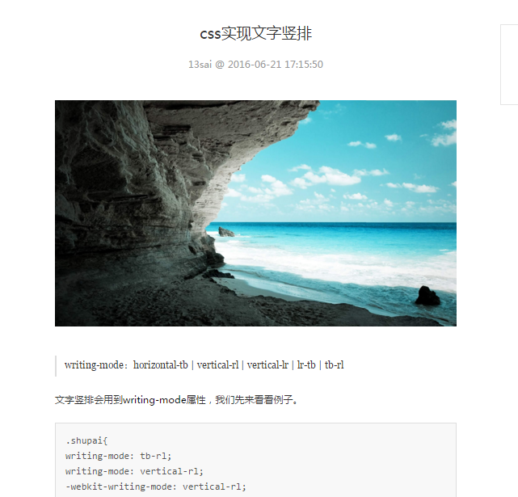
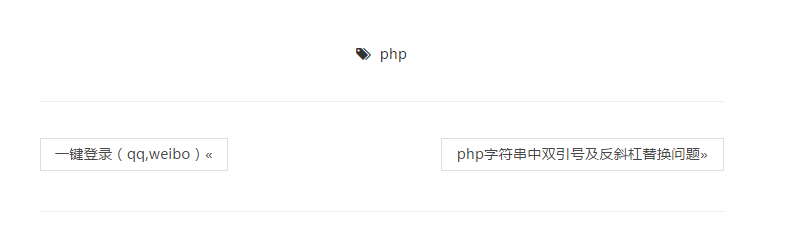

# 第四节  文章详情页


前面我们已经完成了分页列表，现在我们来制作文章详情页。

先修改模型articleModel：
```php 
public function getArticle($table, $id){
	$data = $this->db->where('id=',$id)->get($table);
	return $data->result()[0];
}
```

控制器article：
（也就是之前的articleController，每次写太麻烦，所以我们修改下名字，路由也比较好看）
```php
public function artShow($id){
    $data['data'] = $this->articleModel->getArticle('article', $id);
    $this->load->view('header');
    $this->load->view('artShow', $data);
    $this->load->view('footer');
}
```
视图artShow：
```html
<div class="am-g am-g-fixed blog-fixed blog-content">
    <div class="am-u-md-8 am-u-sm-12">
      <article class="am-article blog-article-p">
        <div class="am-article-hd">
          <h1 class="am-article-title blog-text-center">
	          
            <?php echo $data->title;?>
          </h1>
          <p class="am-article-meta blog-text-center">
              <span>13sai</span>
              <span> @ <?php echo $data->date;?>
		      </span>
              
          </p>
        </div>        
        <div class="am-article-bd">   
	    
               
        <p class="class="am-article-lead"">
        <blockquote>
        <?php
        	echo $data->abstract
        ?>
        
        </blockquote>
        <div>
	        <?php
	        	echo $data->content;
	        ?>
	        
        </div>
        </p>
        </div>
      </article>
        <div class="am-g blog-article-widget blog-article-margin">
          <div class="am-u-lg-4 am-u-md-5 am-u-sm-7 am-u-sm-centered blog-text-center">
            <span class="am-icon-tags"> </span>&nbsp; <?php echo $data->type;?>
          </div>
        </div>
        <hr>
        <ul class="am-pagination blog-article-margin">
        </ul>
        <hr>

    </div>
```

效果如图：


这里我们注意两处，一处是视图*anchor*函数。我们来看看：
*anchor*是一个辅助函数
```php
echo anchor('news/local/123', 'My News', 'title="News title"');
//  <a href="http://example.com/index.php/news/local/123" title="News title">My News</a>

echo anchor('news/local/123', 'My News', array('title' => 'The best news!'));
// <a href="http://example.com/index.php/news/local/123" title="The best news!">My News</a>

echo anchor('', 'Click here');
//  <a href="http://example.com">Click Here</a>
```
看了这三个例子，我似乎也不用解释了
如果你用过*ThinkPHP*，是不是感觉跟U方法很像。但U仅仅用作路由，与这里的*anchor*还是有很大区别，*anchor*直接输出了链接，第一个参数就是路由，也就是index.php/后面的部分，第二个参数是a链接里的文本，第三个就是a链接的各种属性值，可为数组。

另一处需要注意的是控制器里的*$id*，这里的参数克直接调用。
CI的路由很有特色，控制器和方法后面的参数，我们可以直接，有几个用几个，注意对应就行，这点确实比TP方便。

我们完善页面增加上一页下一页，代码比较简单，我就直接上效果。


好，文章详情页我们就圆满完成了。
