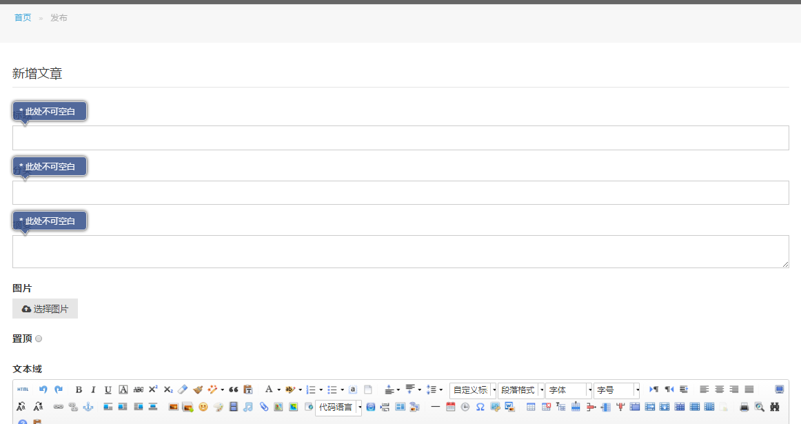
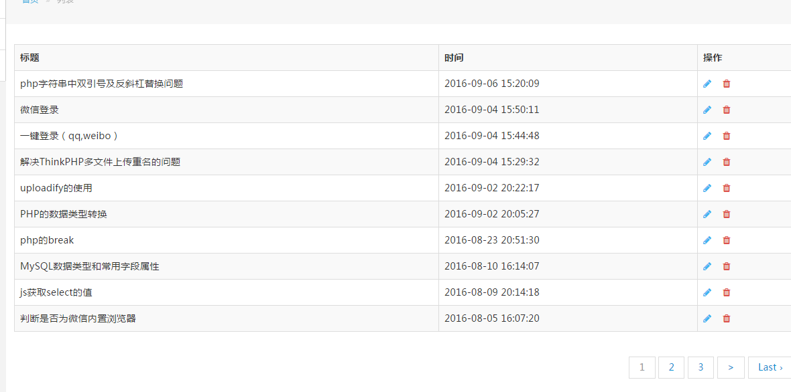

# 第六节 增删改查


上一节我们完成了后台登录，接着要做的就是对文章的管理，不外乎增删改查。

##增
我们先看看要实现的效果：


先搭建视图：
```html
		<ol class="am-breadcrumb">
		  <li><a href="/zeta">首页</a></li>
		  <li class="am-active">发布</li>
		</ol>
		<div class="page-content">
			<form class="am-form" method="post" action="" enctype="multipart/form-data" >
			  <fieldset>
			    <legend>新增文章</legend>
			    <div class="am-form-group">
			      <label for="title">标题</label>
			      <input type="text" id="title" name="title" class="validate[required]">
			    </div>
			    
			    <div class="am-form-group">
			      <label for="type">分类</label>
			      <input type="text" id="type" name="type" class="validate[required]">
			    </div>
			    
			    <div class="am-form-group">
			      <label for="abstract">摘要</label>
			      <textarea id="abstract" name="abstract" class="validate[required]"></textarea>
			    </div>
				
			    <div class="am-form-group am-form-file">
			      <label for="pic">图片</label>
			      <div>
			        <button type="button" class="am-btn am-btn-default am-btn-sm">
			          <i class="am-icon-cloud-upload"></i> 选择图片</button>
			      </div>
			      <input type="file" id="pic" name="pic">
			    </div>

				<div class="am-form-group">
			      <label for="is_top">置顶</label>
			      <input type="radio" id="is_top" name="is_top" value="1">
			    </div>


			    <div class="am-form-group">
			      <label for="editor">文本域</label>
			      <script id="editor" name="content" type="text/plain" style="height:500px;"></script>
			    </div>

			    <p><button type="submit" class="am-btn am-btn-default">提交</button></p>
			  </fieldset>
			</form>
		</div>
	</div>
</div>

<?php $this->load->view('admin/footer') ?>
<script src="/ui/assets/js/amazeui.min.js"></script>
<script type="text/javascript" charset="utf-8" src="/ui/js/ueditor/ueditor.config.js"></script>
<script type="text/javascript" charset="utf-8" src="/ui/js/ueditor/ueditor.all.min.js"> </script>
<script type="text/javascript" charset="utf-8" src="/ui/js/ueditor/lang/zh-cn/zh-cn.js"></script>
<script type="text/javascript">
var ue = UE.getEditor('editor');
$(function(){
	$('.am-form').validationEngine('attach',{
		promptPosition: 'topLeft',
	});
});
</script>
</body>
</html>
```

接着是控制器
```php
public function create(){
    if($_POST){
        $config['upload_path']      = './upload/article';
        $config['allowed_types']    = 'gif|jpg|png';
        $config['max_size']     = 10280;
        $config['max_width']        = 1024;
        $config['max_height']       = 1024;

        $this->load->library('upload', $config);
        if ( ! $this->upload->do_upload('pic')){
            echo "<meta charset='utf-8'/>上传失败！";
	        //$error = $this -> upload -> display_errors();
	        //var_dump($error);
        }else{
	        //$this->upload->do_upload('pic');
            $data = $_POST;
	        $data['pic'] = '/upload/article/'.$this->upload->data('file_name');
            $id = $this->articleModel->insertOne('article',$data);
            if($id == 1){
	            redirect('admin/article/lists');
            }else{
	            echo "<meta charset='utf-8'/>文章发布失败！";
            }
        }
    }else{
        $this->load->view('admin/left');
        $this->load->view('admin/create');
    }
}
```
这里我们遇到了一个上传文件的类,所有参数如下：



一目了然，我就不多说了。

模型：
```php
public function insertOne($table,$data){
	$id = $this->db->insert($table,$data);
	return $id;
}
```
这样增加文章就完成了。

##查
其实和前台列表差不多，没什么好说的。直接上效果。


##删
看看模型：
```php
public function delOne($table,$id,$index =''){
	$index = $index == ''? 'id' : $index;
	$id = $this->db->delete($table,array($index=>$id));
	return $id;
}
```

##改
其实跟增加类似，只是经过了一次查询。
控制器：
```php
public function update($id = ''){
	if($_POST){
        $data = $_POST;
        //判断是否有图片上传
		if(empty($_FILES['pic']['tmp_name'])){
            $id = $this->articleModel->updateOne('article',$data,$this->input->post('id'));
            if($id == 1){
	            redirect('admin/article/lists');
            }else{
	            echo "<meta charset='utf-8'/>文章更新失败！";
            }
        }else{
	        $config['upload_path']      = './upload/article';
	        $config['allowed_types']    = 'gif|jpg|png';
	        $config['max_size']     = 10280;
	        $config['max_width']        = 1024;
	        $config['max_height']       = 1024;
	        $this->load->library('upload', $config);
	        if ( ! $this->upload->do_upload('pic')){
	            echo "<meta charset='utf-8'/>上传失败！";
	        }else{
		        $data['pic'] = '/upload/article/'.$this->upload->data('file_name');
	            $id = $this->articleModel->updateOne('article',$data,$this->input->post('id'));
	            if($id == 1){
		            redirect('admin/article/lists');
	            }else{
		            echo "<meta charset='utf-8'/>文章更新失败！";
	            }
	        }
        }
    }else{
        $data['data'] = $this->articleModel->getArticle('article', $id);
        $this->load->view('admin/left');
        $this->load->view('admin/update',$data);
    }
}	
```

模型：
```php
public function updateOne($table,$data,$id,$index =''){
	$index = $index == ''? 'id' : $index;
	$id = $this->db->where("$index=",$id)->update($table,$data);
	return $id;
}
```

我们的增删改查就一一完成了。